# Git Capstone Project
---
## Enhancing A Community Library Website
---
This Project simulates the roles of two contributors with respective objectives of updating the features of the **Greenwood Community Website**, to include **Book Reviews** page and update an upcoming event on the **Events Page**. The contributors are **Morgan** and **Jamie**. Below is a detailed walkthrough of the tasks performed.

### Repository Setup (Admin)
---
 A new Github Repository `greenwood-library-website` initialized with `README` file was created. 

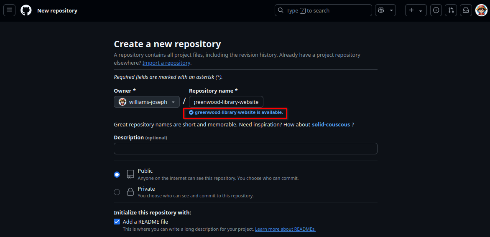
---
Since this project is a simulation of two collaborators on a single machine(Ubuntu), there will be only one `git clone` command.

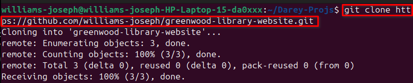
---
Also to properly simulate PR reviews of the two contributors, another Github User was invited as a collaborator.

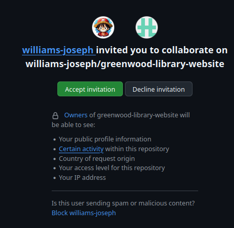
---
Added `home.html`, `about_us.html`,  `events.html`, `contact_us.html` files in text editor(VSCode) simulating the teams's existing codebase.

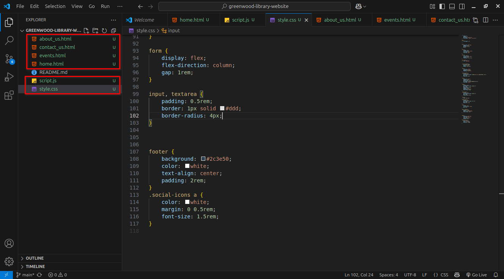
---
Added, Commits and Push the files to Remote Repo.

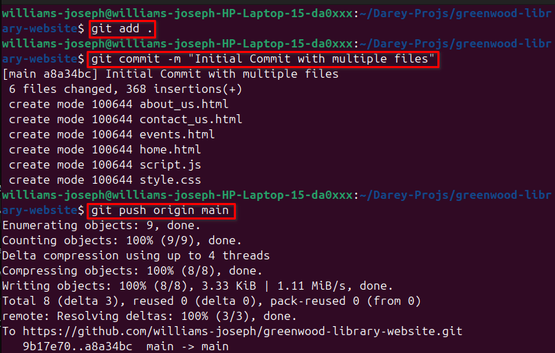
---
Created a New Branch `add-book-reviews` for Morgan's work.

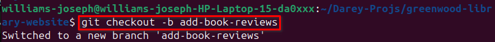
---
 ### Feature Addition: Book Reviews Page by Morgan
 ---
 Morgan creates and edited a new `book_reviews.html` file in VSCode.

 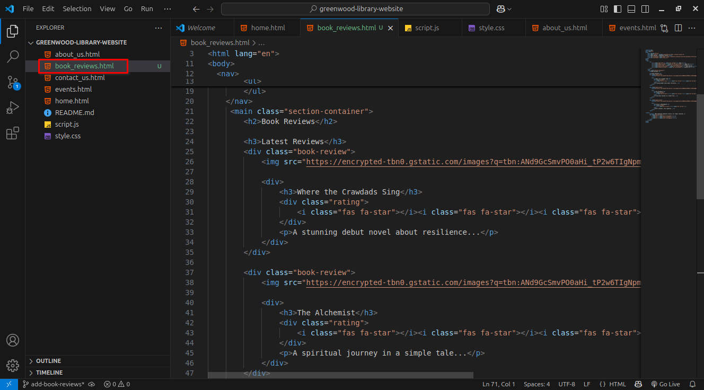
---
Morgan stages the modifications. Then pushes it to the branch.

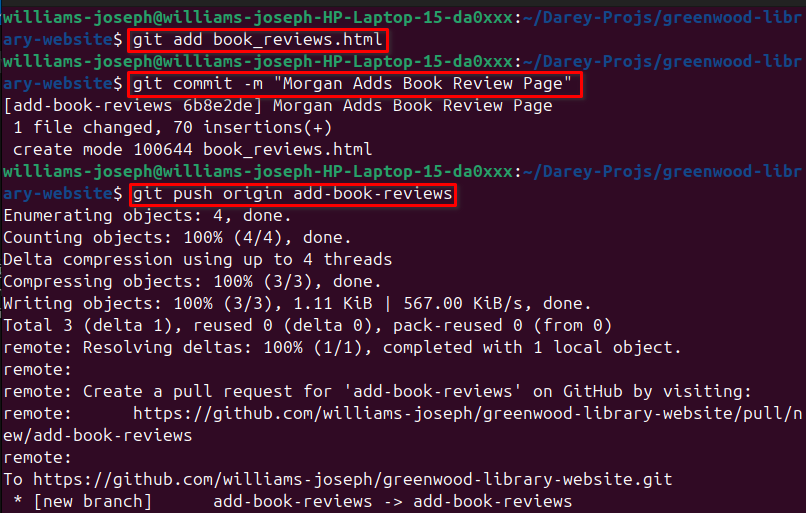

### Content Update: Events Page by Jamie
---
New Branch Created for Jamie's Work.

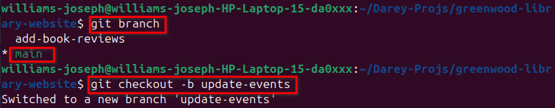
---
Jamie modifies the content in the `events.html` page to add an upcoming event. 

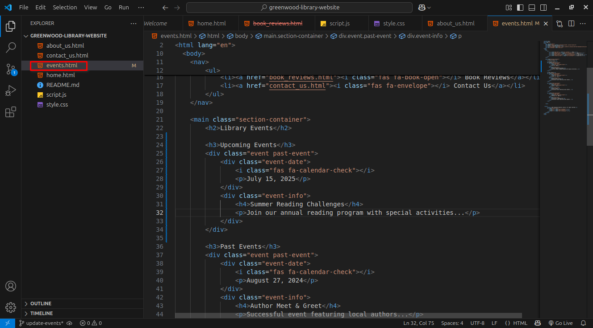
---
Jamie adds, commits and push changes to repo on `update-events` branch.

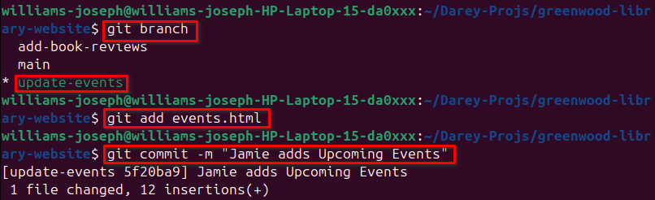

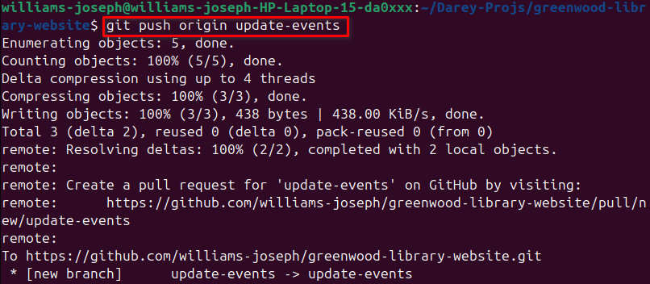
---

### Pull Requests Summary
---
**Morgan PR tasks detailed below:**

- Morgan switches to `book-reviews` branch.

    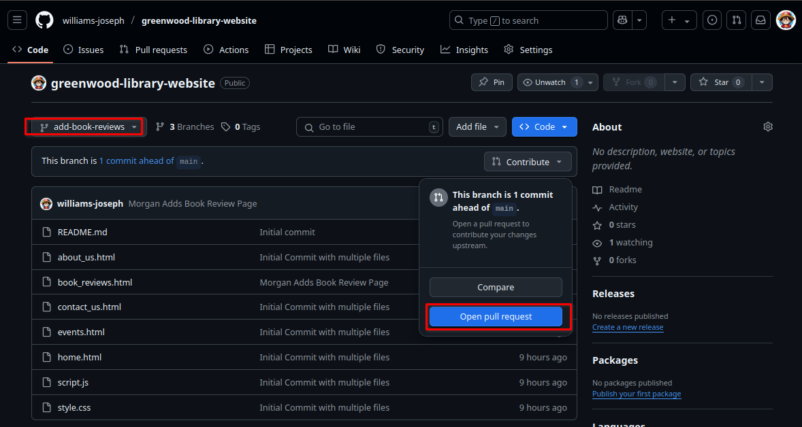

- Morgan creates PR.

    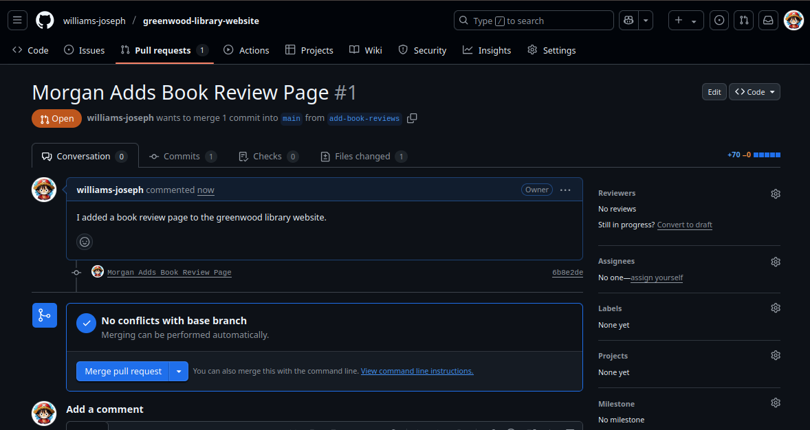

    ---

**Jamie PR tasks detailed below:**

- Jamie switches to `update-events` branch.

    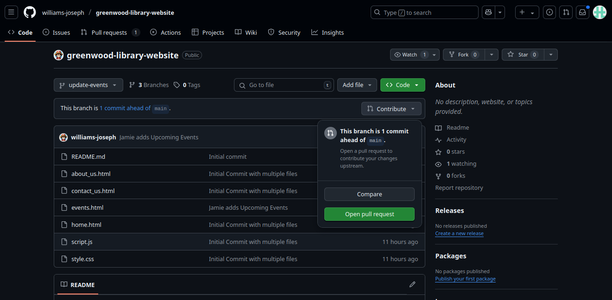

- Jamie creates PR.

    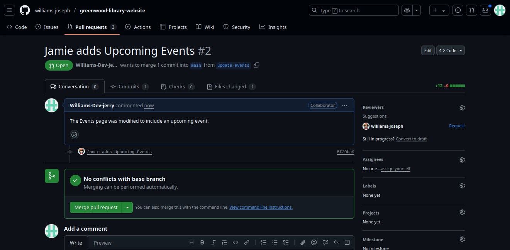
---
- Morgan reviews and accepts Jamie's PR.
    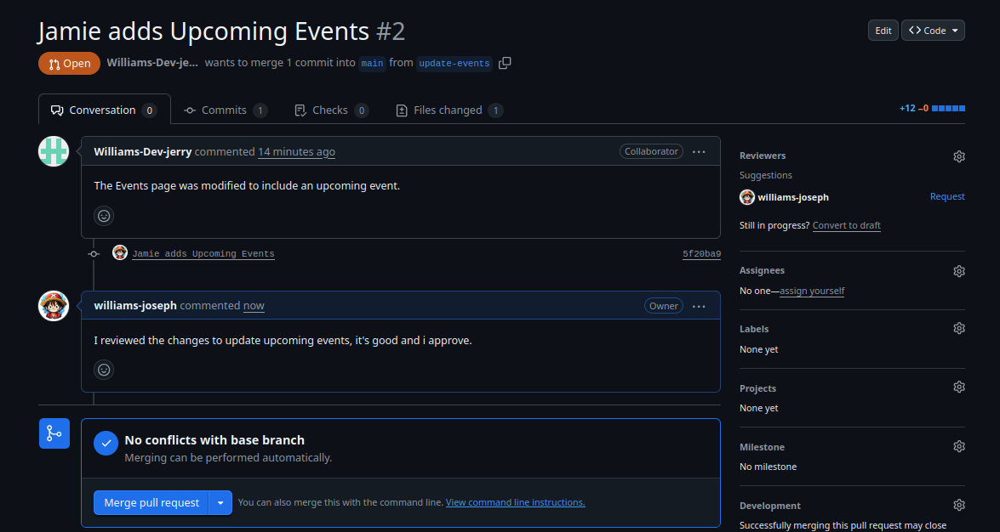

- Jamie reviews and accepts Morgan's PR.
    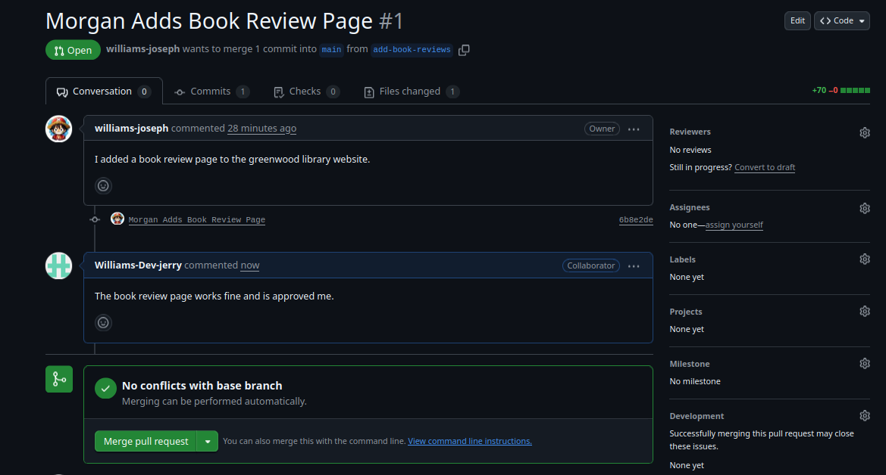

---
### Post-PR Tasks: Merging Contributions
---

- Merging Morgan's work to `main` branch on local Repo.

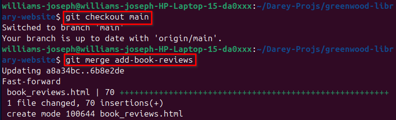

- Pushing Morgan's work to `main` on Remote Repo.

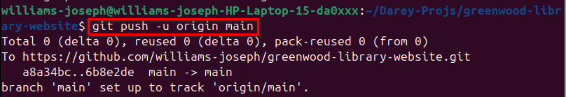

---

- Merging Jamie's work to `main` branch on local Repo.

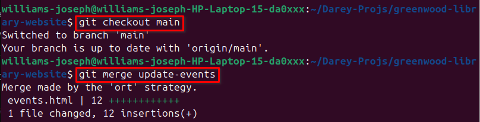

- Pushing Jamie's work to `main` on Remote Repo.

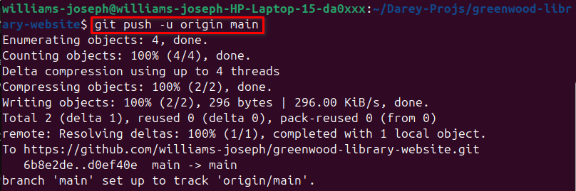
---

### Commit Log Summary
---

Below is a summary of the commit history reflecting individual and collaborative contributions throughout the project:

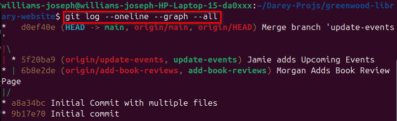

